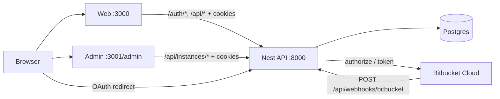

# JIST / Khelo — E2E System Map

Concise end-to-end reference derived from `plane-backend` (NestJS + Prisma) and `plane-frontend` (`apps/web`, `apps/admin`, `packages/services`, `packages/constants`).

---

## 1. System overview

| Surface            | Dev URL                       | Package / entry                                         |
| ------------------ | ----------------------------- | ------------------------------------------------------- |
| Web app            | `http://localhost:3000`       | `apps/web` (`react-router dev --port 3000`)             |
| Admin (“God Mode”) | `http://localhost:3001/admin` | `apps/admin` (port 3001, `VITE_ADMIN_BASE_PATH=/admin`) |
| Nest API           | `http://localhost:8000`       | `plane-backend` (`PORT` default 8000)                   |
| Postgres           | `DATABASE_URL`                | Prisma models in `prisma/schema.prisma`                 |

- Session cookie: `khelo.sid` (express-session + `connect-pg-simple`, table `session`).
- Base URLs: `packages/constants/src/endpoints.ts` (`API_BASE_URL`, `ADMIN_BASE_PATH=/admin`, …).
- Product branding in this fork: **JIST** / **Khelo Tech** (instance default name `"Khelo Tech"`).
- `apps/space` and `apps/live` are not in this system for now.

---

## 2. Architecture



**Nest modules:** `Health`, `Instance`, `Auth`, `Users`, `Workspaces`, `Projects`, `Issues`, `Board` (cycles/modules/pages/views/stickies/estimates/inbox), `Compat` (prefs in Postgres), `Bitbucket` (+ insights), `Mail`.

---

## 3. Admin portal — sidebar features

Sidebar order from `apps/admin/hooks/use-sidebar-menu/index.ts`. All instance routes require session (`AuthGuard`) unless noted.

| Sidebar                   | Route                                             | Primary API                                                                                                               | What it shows                                                                                                     |
| ------------------------- | ------------------------------------------------- | ------------------------------------------------------------------------------------------------------------------------- | ----------------------------------------------------------------------------------------------------------------- |
| **Overview**              | `/overview/`                                      | `GET /api/instances/overview/`                                                                                            | Counts: users, workspaces, projects, issues, active, completed_7d, unassigned; recent work items, activity, users |
| **Users**                 | `/users/`                                         | `GET /api/instances/users/`                                                                                               | Email, display name, workspace memberships + roles, open assignments, created issues, active/onboarding           |
| **Work items**            | `/work-items/`                                    | `GET /api/instances/work-items/?limit=60`                                                                                 | Cross-workspace issues with assignee/state/priority; client filters all/active/unassigned                         |
| **Notifications**         | `/notifications/`                                 | `GET /api/instances/notifications/?limit=80`; `POST …/notifications/mark-read/`                                           | `AdminNotification` rows (`invite_sent`, `invite_accepted`, …); unread count                                      |
| **Activity**              | `/activity/`                                      | `GET /api/instances/activity/?limit=60`                                                                                   | Recent `IssueActivity` (assignment/state/field updates) with deep links into web                                  |
| **Workspaces**            | `/workspace/`                                     | `GET /api/instances/workspaces/`; create via `POST /api/instances/workspaces/`                                            | Instance-wide workspace list; create + slug check                                                                 |
| **Engineering analytics** | `/engineering/`                                   | `GET /api/instances/engineering/analytics/`; remind `POST /api/instances/engineering/remind-bitbucket/:userId/`           | Invitees/members, BB link status, 60d/14d commits by repo/branch, AI/quality averages, at-risk flags              |
| **General**               | `/general/`                                       | `GET/PATCH /api/instances/`; admins `GET /api/instances/admins/`                                                          | Instance name, telemetry, admin email display                                                                     |
| **Authentication**        | `/authentication/` (+ google/github/gitlab/gitea) | `GET/PATCH /api/instances/configurations/`                                                                                | Toggles: `ENABLE_SIGNUP`, `ENABLE_EMAIL_PASSWORD`, `IS_*_ENABLED`, OAuth client IDs/secrets                       |
| **Email**                 | `/email/`                                         | Configurations + `POST /api/instances/email-credentials-check/`; disable `DELETE …/configurations/disable-email-feature/` | SMTP keys: `ENABLE_SMTP`, `EMAIL_HOST`, `EMAIL_PORT`, `EMAIL_*`, `EMAIL_FROM`                                     |

**Admin auth**

- Sign-in/up: `POST /api/instances/admins/sign-in/`, `…/sign-up/` (redirects under `/admin`).
- Session: same `khelo.sid`; `GET /api/instances/admins/me/`.
- Admin signup uses auth service with invite-gate bypass for bootstrap.

---

## 4. Invite / SMTP / join notification flow

```mermaid
sequenceDiagram
  participant Admin as Workspace admin
  participant API as Nest API
  participant Mail as MailService
  participant DB as Postgres
  participant User as Invitee

  Admin->>API: POST /api/workspaces/:slug/invitations/
  API->>DB: upsert WorkspaceInvitation (default role 15)
  API->>DB: AdminNotification type=invite_sent
  API->>Mail: sendMail (nodemailer if SMTP on)
  Mail-->>User: Invite email + invite_link
  User->>Browser: /workspace-invitations/?invitation_id&email&slug
  User->>API: POST /auth/sign-up/ (or accept while signed in)
  API->>DB: User + WorkspaceMember; invitation accepted
  API->>DB: AdminNotification type=invite_accepted
```

**Details**

- Invite create: `WorkspacesService.createInvitations` — requires workspace **admin** (`role >= 20`) or owner.
- Link shape: `{APP_BASE_URL}/workspace-invitations/?invitation_id={id}&email={email}&slug={slug}`.
- Public peek: `GET /api/workspaces/:slug/invitations/:invitationId/join/`.
- Accept while logged in: `POST /api/users/me/workspaces/invitations/` (join) / list pending.
- SMTP: `MailService` reads `InstanceConfiguration`; skips send (logs) if `ENABLE_SMTP != "1"` or host/from missing — invite + notification still persist.
- Signup is **invite-only** after the first user (`AuthService.emailCheck` / `signUp` code `5015`); first user bootstraps freely. Any pending invite for the email also unlocks signup.

---

## 5. Web user journey

1. **Signup / invite-only** — `/sign-up`, `/sign-in` → `POST /auth/email-check/`, `POST /auth/sign-up|sign-in/` → session → `/onboarding` (or workspace if invite joined).
2. **Onboarding** (`apps/web/core/components/onboarding/steps/root.tsx`):
   - Profile → Role → Use case → **Bitbucket connect** → Workspace create/join → Invite members.
   - Progress: `PATCH /api/users/me/onboard/`, profile `PATCH /api/users/me/`, `…/me/profile/`.
3. **Bitbucket connect** — OAuth `GET /api/auth/bitbucket/?next=/onboarding/` → callback; or manual `POST /api/users/me/bitbucket/`. Status `GET /api/users/me/bitbucket/`. Step blocks continue until linked.
4. **Workspace create / join**
   - Create: UI `/create-workspace` → `POST /api/workspaces/` (also admin `POST /api/instances/workspaces/`).
   - Join invites: `GET /api/users/me/workspaces/invitations/` then join POST.
   - Gate: config `DISABLE_WORKSPACE_CREATION`.
5. **Project create** — see §6.
6. **Work items** — `POST/GET/PATCH /api/workspaces/:slug/projects/:projectId/issues|work-items/…` (`IssuesModule`). Lists, bulk ops, labels, display properties.

**Other useful user APIs:** `GET /api/users/me/`, `…/me/workspaces/`, `…/me/workspaces/:slug/project-roles/`, favorites under `/api/workspaces/:slug/user-favorites/`.

---

## 6. Project creation E2E

| Layer                | What happens                                                                                                            |
| -------------------- | ----------------------------------------------------------------------------------------------------------------------- |
| **UI**               | Project create modal/form in web → `ProjectService.createProject` (`apps/web/core/services/project/project.service.ts`) |
| **HTTP**             | `POST /api/workspaces/:slug/projects/` body `{ name, identifier, description?, network? }`                              |
| **Service**          | `ProjectsService.create` — membership required; identifier uppercased alphanumeric ≤5                                   |
| **DB (transaction)** | `Project` + `ProjectMember` (creator `role=20`) + default `State` rows from `DEFAULT_STATES`                            |
| **Defaults**         | Backlog (default), Todo, In Progress, Done, Cancelled                                                                   |

Related:

- Identifier check: `GET /api/workspaces/:slug/project-identifiers/?name=`
- Members: `/api/workspaces/:slug/projects/:projectId/members/`
- States: `/api/workspaces/:slug/projects/:projectId/states/`

---

## 7. What a single user can see (roles)

**Workspace / project roles** (`EUserWorkspaceRoles` in `@plane/types`):

| Role   | Int | Typical capabilities in this Nest backend                                                                                          |
| ------ | --- | ---------------------------------------------------------------------------------------------------------------------------------- |
| Guest  | 5   | Member of workspace/project with restricted UI (Plane conventions); not invite/admin                                               |
| Member | 15  | Default invite role; create/use projects & issues when membership allows                                                           |
| Admin  | 20  | Invite/delete invitations, manage members, link Bitbucket repos, engineering analytics for workspace; project creator starts as 20 |

**Rough visibility**

- **Workspace member:** own workspaces (`GET /api/users/me/workspaces/`), projects in those workspaces, issues in projects they can access, own Bitbucket identity/commits linked to them.
- **Workspace admin / owner:** above + invitations, member role changes, `POST /api/workspaces/:slug/bitbucket/repos/`, `GET …/engineering/analytics/`.
- **Instance admin (admin app):** cross-tenant `GET /api/instances/*` (overview, users, work-items, activity, notifications, engineering). Session authenticated; admin UI is the operational surface. Instance config/auth/email patches.

Guards: most `/api/*` use session `userId`; workspace routes resolve membership via `getRawMemberWorkspace`. Invite/admin actions check `role >= 20` or `ownerId`.

---

## 8. Data the system can gather

| Domain                          | Models / sources                                        | Notable fields                                                                                                                        |
| ------------------------------- | ------------------------------------------------------- | ------------------------------------------------------------------------------------------------------------------------------------- |
| Users                           | `User`                                                  | email, names, onboard/tour flags, job `role`, `useCase`, timezone                                                                     |
| Workspaces                      | `Workspace`, `WorkspaceMember`, `WorkspaceInvitation`   | slug, org size, member roles, invite tokens/accepted                                                                                  |
| Projects                        | `Project`, `ProjectMember`, `State`, `Label`            | identifier, feature flags (cycle/module/page/inbox), membership                                                                       |
| Issues / activity               | `Issue`, `IssueAssignee`, `IssueLabel`, `IssueActivity` | priority, dates, state, actor/verb/field diffs                                                                                        |
| Bitbucket identity              | `BitbucketIdentity`                                     | accountId, emails, encrypted tokens, scopes                                                                                           |
| Repo links                      | `BitbucketRepoLink`                                     | repo UUID/slug, BB workspace slug, optional `projectId`                                                                               |
| Commits (≈60d analytics window) | `BitbucketCommit`                                       | hash, **message**, **branch**, author, committedAt, additions/deletions, filesTouched, languages, linkedIssueIds                      |
| Commit insights                 | `CommitInsight`                                         | `aiLikelihood`, `qualityScore`, `structureScore`, `churnRatio`, `signals` (heuristic — trailers, size, blast radius; not proof of AI) |
| Admin notifications             | `AdminNotification`                                     | type, title, body, meta, readAt                                                                                                       |
| Instance                        | `Instance`, `InstanceConfiguration`                     | name/version; SMTP, OAuth, signup, Unsplash, LLM keys, etc.                                                                           |

**Ingest path:** Bitbucket push → `POST /api/webhooks/bitbucket/` → match `BitbucketRepoLink` by repo UUID → upsert commits + insights; optional issue key match into `linkedIssueIds`.

**Analytics surfaces**

- Instance: `GET /api/instances/engineering/analytics/` (admin engineering page).
- Workspace: `GET /api/workspaces/:slug/engineering/analytics/`.
- Issue/project commit lists: `…/issues/:issueId/bitbucket/commits/`, `…/projects/:projectId/bitbucket/commits/`.

---

## 9. Known gaps / stubs

- **Board (Nest + Postgres):** cycles, modules, pages, views, stickies, estimates, inbox, drafts, webhooks list are real tables/APIs under `BoardModule` (not empty stubs). Analytics charts / file uploads remain thin. Multiplayer page collab (`apps/live`) is not in this repo for now.
- **OAuth providers (Google/GitHub/GitLab/Gitea):** admin UI + config keys exist; primary production path in this Nest cut is **email/password + Bitbucket** for engineering.
- **Branch on commits:** branch is taken from Bitbucket **push** webhook `change.new.name`. Commits ingested without that context group as `"unknown"`; analytics branch breakdown reflects **new webhook traffic**, not backfilled history.
- **Invite email without SMTP:** invitation + `invite_sent` notification still written; email send skipped with warning.
- **Spaces / Live:** ports and URL constants exist; this Nest backend focuses on API + Bitbucket; full Plane Docker stack in older guides may differ from local Nest-only dev.
- **Unsplash:** `GET /api/unsplash/` returns empty `{ results: [] }` when `UNSPLASH_ACCESS_KEY` (config or env) is missing (`compat/unsplash.controller.ts`). Image picker stays quiet.
- **Admin AI / Image:** routes remain in `apps/admin/app/routes.ts` (`/ai`, `/image`) but are **not** in the sidebar menu; LLM keys still exist on configurations (`LLM_API_KEY`, `LLM_MODEL`).

---

## Quick endpoint index (high-traffic)

```
Auth:     POST /auth/sign-up|sign-in|sign-out|email-check  GET /auth/get-csrf-token
Users:    /api/users/me[/profile|/onboard|/workspaces|/workspaces/invitations|…]
WS:       /api/workspaces[/|:slug|/members|/invitations|…]
Projects: /api/workspaces/:slug/projects[|/details|/:id|/states|/members]
Board:    /api/workspaces/:slug/{cycles|modules|pages|views|stickies|…}
          /api/workspaces/:slug/projects/:id/{cycles|modules|pages|views|estimates|inbox-issues}
Issues:   /api/workspaces/:slug/projects/:projectId/issues|work-items[…]
Instance: /api/instances[/overview|/users|/work-items|/activity|/notifications|/configurations|/workspaces]
BB:       /api/auth/bitbucket[|/callback]  /api/users/me/bitbucket
          /api/webhooks/bitbucket  /api/workspaces/:slug/bitbucket/repos
          /api/instances/engineering/analytics
Health:   GET /api/health
```

---

_Source roots: `plane-backend/src`, `plane-backend/prisma/schema.prisma`, `plane-frontend/apps/{web,admin}`, `packages/{services,constants,types}`._
